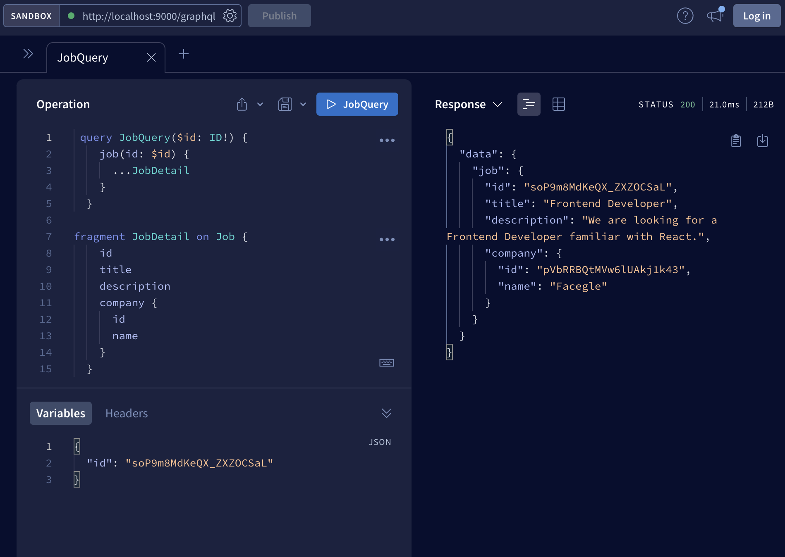
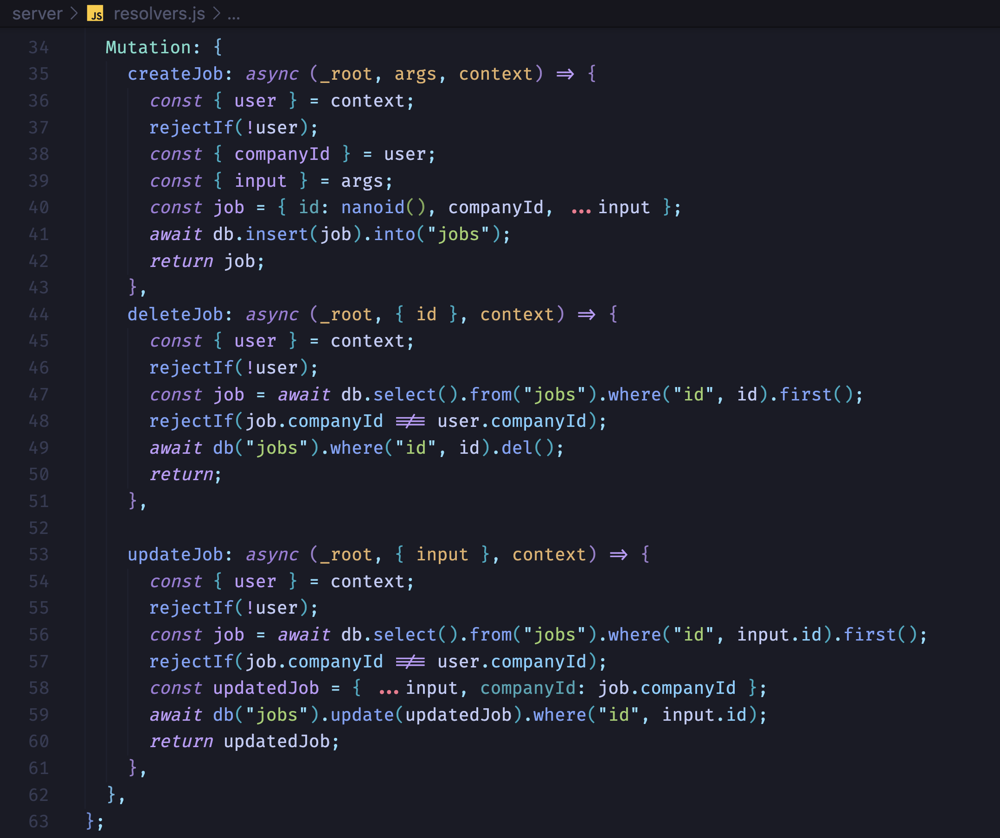
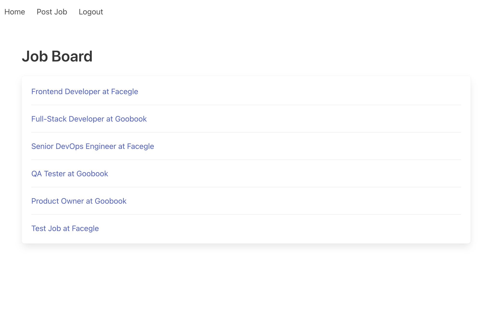

# Job Board Project





# What is GraphQL?

GraphQL is a query language for APIs

Another query language is SQL, so think about some things you can do with SQL.

Why use GraphQL instead of Rest APIs?

## Ask what you need, get exactly that.

Send a GraphQL query to you API and get exactly what you need, nothing more and nothing less.

Apps using GraphQL are fast and stable because they control the data they get, not the server.

The Client has full control of what data do it needs from the server.

With Rest APIs you don't have control of what data do you want or not. You can get too much data, data that you don't use.

In Rest if you want data from 2 different resources, then you need to perform 2 separate API calls. With GraphQL you can fetch data from different resources in one call.

GraphQL resolves under fetching and over fetching of data.

## Describe what's possible with a type system

GraphQL is schema first approach.

You can create faster powerful developer tools.

Bring your own data and code, you can use GraphQL on top of your existing system, you don't need to rewrite everything.

Facebook created GraphQL you power up their mobile apps, they were too slow because they were doing too many API calls.

## Apollo Server

Easy way to setup a GraphQL server

# Working with GraphQL

## Queries

When we do a query, we always use the POST method, and the body is a json with the query itself.

By default the apollo graphql sandbox has schema polling enable.

At the end of the day all graphQL Clients create HTTP request for doing queries, so you can use GraphQL in any programming language and framework.

### Resolution Chain

GraphQL has a 'resolution chain', it works like a tree from top to button.

First it starts at the Query object and we can writing specific resolvers as needed for every type in our schema.

### Query Arguments

To pass in information, for example get a specific item by its ID.

Client Query:

```
query{
  job(id: "soP9m8MdKeQX_ZXZOCSaL") {
    id
    title
  }
}
```

Server schema definition:

```
type Query {
  jobs: [Job!]
  job(id: ID!): Job # return a single job
}
```

### Query Variables

We can name a query

Client side query:

```
query JobQuery {

}
```

Then using parenthesis we can pass it variables, variables starts with a dollar $ sign.

Client side query:

```
query JobQuery($id: ID!){
  job(id: $id) {
    id
    title
    description
    company {
      id
      name
    }
  }
}
```

Then in the GraphQL Sandbox we can add the value of the variable in the "Variables" tab, but now without dollar $ sign.

```
{
  "id": "soP9m8MdKeQX_ZXZOCSaL"
}
```

It is a good practice to always name your queries, makes debugging easier.

### Object Graph Navigation

With GraphQL we can create associations between objects in both directions, and easy navigate between them.

Server side schema:

```
type Query {
  jobs: [Job!]
  job(id: ID!): Job # return a single job
  company(id: ID!): Company
}

type Job {
  id: ID!
  title: String!
  description: String
  company: Company!
}

type Company {
  id: ID!
  name: String!
  description: String
  jobs: [Job!]
}

```

When requesting a single job or a list of jobs, we get the company data for each job.

And also, when requesting a single company, we can then navigate and get data of multiple jobs.

Server side resolvers:

```
export const resolvers = {
  Query: {
    jobs: async () => Job.findAll(),
    job: (_root, args) => {
      const id = args.id;
      return Job.findById(id);
    },
    company: (_root, { id }) => Company.findById(id),
  },

  Job: {
    company: (job) => {
      return Company.findById(job.companyId);
    },
  },

  Company: {
    jobs: (company) => Job.findAll((job) => job.companyId === company.id),
  },
};
```

We can even create **recursive** nested queries:

```
query CompanyQuery ($id: ID!){
  company(id: $id) { # getting Company
    name
    description
    jobs {  # getting Job
      title
      id
      company {  # getting Company Again !
        id
        name
      }
    }
  }
}
```

**GraphQL will resolve the client query using the resolvers recursively.**

Facebook created GraphQL to easy traverse graphs, if you think about it, Facebook network is a big graph between friends relationships.

## Mutations

Mutations is about modifying data.

For examples, if you want to submit a form and save the data in the database.

Inside schema.graphql:

```
type Mutations {
  createJob(title: String!, companyId: ID!, description: String): Job
}
```

In the above example title and companyId are mandatory fields, description is optional.

We are also returning the new created Job.

Mutation Request:

```
mutation Mutation {
  createJob(
    title: "Job 1" ,
    companyId: "pVbRRBQtMVw6lUAkj1k43" ,
    description: "text"
  ) {
    id,
    title,
    company {
      id,
      name
    }
  }
}
```

Note that we are also defining which Job fields do we want in the response.

Response:

```
{
  "data": {
    "createJob": {
      "id": "qM5zOG6sKi0JZbeJ0mqTC",
      "title": "Job 1",
      "company": {
        "id": "pVbRRBQtMVw6lUAkj1k43",
        "name": "Facegle"
      }
    }
  }
}
```

Note how an id was automatically created by the server.

### Input Types

Instead of passing a list of lots of arguments we can use input types. We should use the **type** keyword for declaring inputs.

Before:

```
type Mutation {
  createJob(title: String!, companyId: ID!, description: String): Job
}
```

Using Input Types:

```
input CreateJobInput {
  title: String!
  companyId: ID!
  description: String
}

type Mutation {
  createJob(input: CreateJobInput!): Job
}

```

In the request now we can use variables:

```
// Request:

mutation CreateJoMutation($input: CreateJobInput!) {
  job: createJob(
    input:$input
  ) {
    id,
    title,
    company {
      id,
      name
    }
  }
}

// Variables:

{
  "input": {
    "title": "Job 2",
    "companyId": "pVbRRBQtMVw6lUAkj1k43",
    "description": "test Description 2"
  }
}
```

Since we used an alias "job" in the "createJob" query,then we get that name in the response:

Response:

```
{
  "data": {
    "job": {
      "id": "3FLBYUjq8wHoQO8W3t6GO",
      "title": "Job 3",
      "company": {
        "id": "pVbRRBQtMVw6lUAkj1k43",
        "name": "Facegle"
      }
    }
  }
}
```

## The N + 1 Query Problem

Let's log every time we do a SQL query in our relational database.

db.js:

```
import knex from "knex";

export const db = knex({
  client: "better-sqlite3",
  connection: {
    filename: "./data/db.sqlite3",
  },
  useNullAsDefault: true,
});

db.on("query", ({ sql, bindings }) => {
  console.log("[db] query:", sql, bindings);
});

```

If we use our Client app to see a List of Jobs, we'll see that we are doing a **lot of queries.**

Server logs:

```
[db] query: select * from `jobs` []
[db] query: select * from `companies` where `id` = ? limit ? [ 'pVbRRBQtMVw6lUAkj1k43', 1 ]
[db] query: select * from `companies` where `id` = ? limit ? [ 'pVbRRBQtMVw6lUAkj1k43', 1 ]
[db] query: select * from `companies` where `id` = ? limit ? [ 'wvdB54Gqbdp_NZTXK9Tue', 1 ]
[db] query: select * from `companies` where `id` = ? limit ? [ 'wvdB54Gqbdp_NZTXK9Tue', 1 ]
[db] query: select * from `companies` where `id` = ? limit ? [ 'pVbRRBQtMVw6lUAkj1k43', 1 ]
[db] query: select * from `companies` where `id` = ? limit ? [ 'pVbRRBQtMVw6lUAkj1k43', 1 ]
[db] query: select * from `companies` where `id` = ? limit ? [ 'wvdB54Gqbdp_NZTXK9Tue', 1 ]
```

This is known as the N + 1 Quey Problem.

We did 1 query for actually getting the List of Jobs. But then we did N queries to get the Company for each job.

If we have a list of 200 jobs, our code we'll do 201 queries. This leads to **bad performance** and **it is not scalable.**

We can see **why** this is happening by looking to our resolvers:

```
export const resolvers = {

  Query: {
    jobs: async () => await db.select().from("jobs"), // 1 Query
  },

  Job: {
    // first argument is the parent object, in thi case a job
    company: (job) => {
      // resolves a company for a job
      return db.select().from("companies").where("id", job.companyId).first(); // N Queries
    },
  },
}

Total: N + 1 Queries.
```

Even if some companies share the same jobID, we'll done 1 query individually for each company.

But we can translate these GraphQL to a efficient SQL query:

```
SELECT job.id, job.title, company.id, company.name
FROM jobs as job
JOIN companies as company
ON company.id = job.companyId;
```

Problem: **Translating every GraphQL to an optimized SQL query will be very difficult, because remember: the client can choose what to request in the query, there are too many possible combinations.**

We don't know at which point an efficient SQL query is necessary.

There is a solution to this problem: **The DataLoader** library, which is a generic tool, works with every type of database, or even if we load data form an API.

Batching: the ability of load multiple items in a single request, this is what we need. It also provides caching features.

```
npm i -S dataloader
```

db.js:

```
import DataLoader from "dataloader";

export const companyLoader = new DataLoader(async (companyIds) => {
  console.log("[companyLoader] companyIds: ", companyIds);
  const companies = await db
    .select()
    .from("companies")
    .whereIn("id", companyIds);

  // we must ensure that we return in the same order as in the input array
  return companyIds.map((companyId) => {
    return companies.find((company) => company.id === companyId);
  });
});

```

resolver.js:

```
export const resolvers = {
  Query: {
    jobs: async () => await db.select().from("jobs"), // 1 Query
  },
  Job: {
    // first argument is the parent object, in thi case a job
    company: async (job) => {
      // resolves a company for a job
      return  await companyLoader.load(job.companyId); // collects the ids
    },
  },
}

```

If we look at the logs:

```
[db] query: select * from `jobs` []
[companyLoader] companyIds:  [ 'pVbRRBQtMVw6lUAkj1k43', 'wvdB54Gqbdp_NZTXK9Tue' ]
[db] query: select * from `companies` where `id` in (?, ?) [ 'pVbRRBQtMVw6lUAkj1k43', 'wvdB54Gqbdp_NZTXK9Tue' ]
```

We are just doing 2 Queries always, which is much better. We solve it using batching.

If we do the same query again, we only do 1 query, because it cached the data of the companies since we only have 1 global companyLoader instance.

```
[db] query: select * from `jobs` []
```

In a lot of scenarios we want always fresh data. **We can create a function that always returns a new DataLoader.**

db.js:

```
export function createCompanyLoader() {
  return new DataLoader(async (companyIds) => {
    console.log("[companyLoader] companyIds: ", companyIds);
    const companies = await db
      .select()
      .from("companies")
      .whereIn("id", companyIds);

    // we must ensure that we return in the same order as in the input array
    return companyIds.map((companyId) => {
      return companies.find((company) => company.id === companyId);
    });
  });
}
```

Update server.js to pass a new companyLoader in the context for every new request:

```
const context = async ({ req, res }) => {
  const companyLoader = createCompanyLoader();

  if (req.auth) {
    const user = await db
      .select()
      .from("users")
      .where("id", req.auth.sub)
      .first();
    return { user, companyLoader };
  }
  return { companyLoader };
};

```

Update resolvers.js to use the loader form the context:

```
export const resolvers = {
  Query: {
    jobs: async () => await db.select().from("jobs"), // 1 Query
  },
  Job: {
    company: async (job) => {
      // resolves a company for a job
      return  await companyLoader.load(job.companyId);
    },
}
```

Now, no data is being cached, we create a new DataLoader in every new request.
