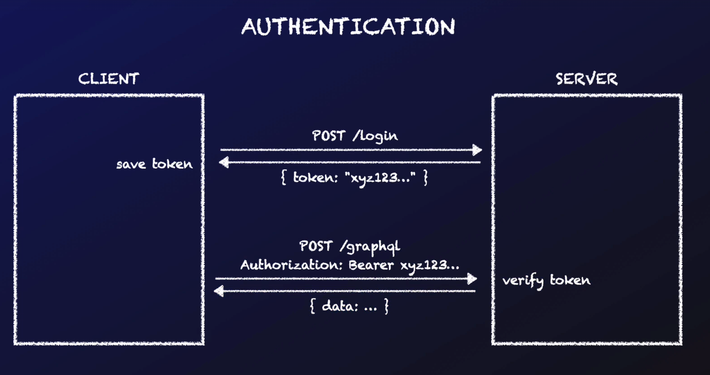

# Server

## Authorization Flow

We create a POST endpoint separate from our GraphQL endpoint where we handle de Login request, we return to the user an authorization token, then they need to use that bearer token in order to do request to our GraphQL server.

In the client we are storing this token in local storage, but in reality we should do it using cookies.



In the server there is also a middleware, a function that is applied every time a request is received. In this middleware we verify if there is a JWT.

```
// middleware it is applied to every request we receive
app.use(
  cors(),
  express.json(),
  expressjwt({
    algorithms: ["HS256"],
    credentialsRequired: false,
    secret: JWT_SECRET,
  })
);
```

In our graphQL resolver we can use the context argument to get any other parameters we passed to our request, from the context we can get the auth data.

```
const context = ({ req, res }) => ({ auth: req.auth });

const apolloServer = new ApolloServer({ typeDefs, resolvers, context });
```

The auth data should be send in a Header on the HTTP Request made by the client.

Authorization: bearer {token}

Resolver function with auth checks:

```
Mutation: {
    createJob: async (_root, args, context) => {
        const { auth } = context;
        if (!auth) {
            throw new Error("Unauthorized");
        }
        const { input } = args;
        const job = await Job.create(input);
        return job;
    }
}
```

### Adding the complete user data instead of only the auth token

server.js:

```
const context = async ({ req, res }) => {
  if (req.auth) {
    const user = await User.findById(req.auth.sub);
    return { user };
  }
  return {};
};

const apolloServer = new ApolloServer({ typeDefs, resolvers, context });
```

resolvers.js:

```
Mutation{
 createJob: async (_root, args, context) => {
      const { user } = context;
      if (!user) {
        throw new Error("Unauthorized");
      }
      const { companyId } = user;
      const { input } = args;
      const job = await Job.create({ ...input, companyId });
      return job;
  }
}
```
